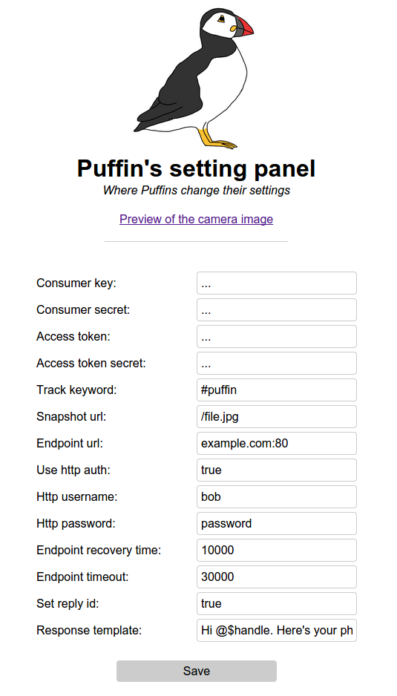

## Evercam puffin


### A simple program for replaying to tweets with a keyword with an image from an http server

### To run

```bash
npm install
npm start
# Use the configuration panel (port 1024 by default) to configure
```

* You can use [Bunyan](https://github.com/trentm/node-bunyan) for pretty-printing the log output
* It can be configured through `config.json`

### Features
* Automated watermarking
* Periodically updating image cache
* Comprehensive logging with Bunyan
* Simple to use online configuration panel



### Credits
Puffin image: [This is Not That Blog](http://thisisnotthatblog.com/2011/03/31/im-sorry-i-didnt-draw-a-puffin-until-just-now/), All Right Reserved
